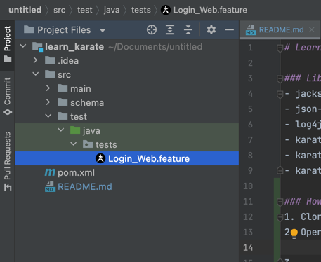

# Learn Api Test with Karate Framework

### Library
- jackson-core : 2.12.0
- json-schema-validator : 2.2.8
- log4j : 1.2.17
- karate-apache : 0.9.6
- karate-core : 1.4.0
- karate-junit4 : 1.4.0.RC3

### How to Run
1. Open Your Intellij Idea
2. Clone the projects
3. Reload the pom.xml!
[img_2.png](img_2.png)
4. Open the feature files

5. run the Feature files or Scenario Outline
